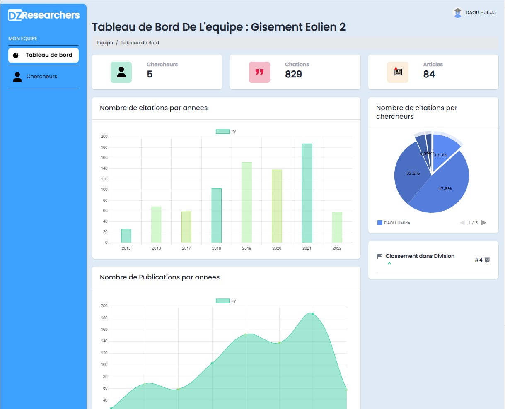

<!-- # Table of contents  -->

# How to run it 
1. first clone it 
```bash
git clone https://github.com/ilyes-d/django-algerian-researche-indicator.git
```
2. get inside the main folder 
```bash
cd django-algerian-researche-indicator
```
3. then install the requirements 
```bash
pip install -r requirements.txt
```
4. Now run the server 
```bash
python manage.py runserver
```
# Algerian Research Indicators 

- [x] SIG dashboard
- [x] all roles dashboard
- [x] add filters

# pages 
|Login Page|
|---|
||

|Register page |
|-|
||

|Dashboard level 1|
|-|
||

|Dashboard level 2|
|-|
||

|Dashboard level 3|
|-|
||

|Dashboard level 4|
|-|
||


